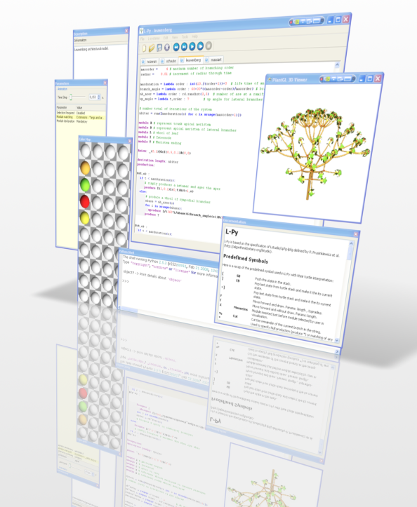
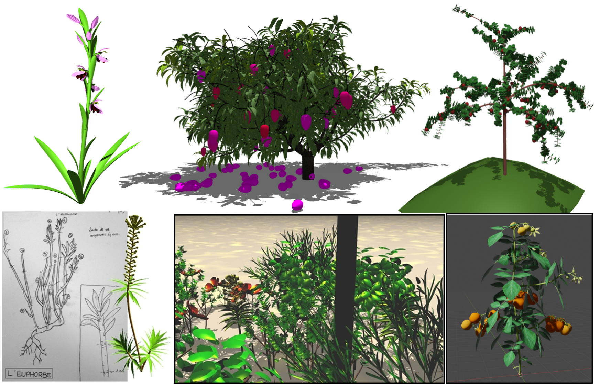

.. image:: https://img.shields.io/badge/License-GPL-blue.svg
   :target: https://opensource.org/licenses/GPL-3.0

.. image:: https://github.com/openalea/lpy/actions/workflows/conda-package-build.yml/badge.svg
    :target: https://github.com/openalea/lpy/actions/workflows/conda-package-build.yml
    :alt: Github Actions Continuous Integration Status

.. image:: https://ci.appveyor.com/api/projects/status/8bd8xhc9wy0bee0k/branch/master?svg=true
   :target: https://ci.appveyor.com/project/fredboudon/lpy
   :alt: AppVeyor Continuous Integration Status

.. image:: https://readthedocs.org/projects/lpy/badge/?version=latest
    :target: https://lpy.readthedocs.io/en/latest/?badge=latest
    :alt: Documentation Status

=======
L-Py
=======

L-systems were conceived as a mathematical framework for modeling growth of plants. 
L-Py is a simulation software that mixes L-systems construction with the Python high-level modeling language. 

In addition to this software module, an integrated visual development environment has been developed that facilitates the creation of plant models.
In particular, easy to use optimization tools have been integrated. 
Thanks to Python and its modular approach, this framework makes it possible to integrate a variety of tools defined in different modeling context, in particular tools from the OpenAlea platform. Additionally, it can be integrated as a simple growth simulation module 
into more complex computational pipelines.

**L-Py** is released under a **CeCILL** license, which is compatible to the **GNU GPL**.

=======
Gallery
=======

Examples of models created with L-Py. Images credits: C. Godin, J. Chopard, F. Boudon. Models credits: C. Godin, F. Boudon, F. Normand, I. Grechi, E. Costes, M. Beziz, Y. Caraglio et al.

=============
Installation
=============

``L-Py`` distribution is based on the ``conda`` software environment management system.
To install conda, you may refer to its installation page: https://docs.conda.io/projects/conda/en/latest/user-guide/install/

To install L-Py, you need to create an environment (named for instance lpy) :

.. code-block:: bash

        >>> conda create -n lpy openalea.lpy -c openalea3 -c conda-forge

The package ``openalea.lpy`` is retrieved from the ``openalea3`` channel (developement) and its dependencies will be taken from ``conda-forge`` channel.

Then, you need to activate the L-Py environment

.. code-block:: bash

        >>> conda activate lpy

And then run L-Py

.. code-block:: bash

        >>> lpy

=============
Documentation
=============

Documentation is available at `<http://lpy.readthedocs.io/en/latest/>`_

Help and Support
----------------

Please open an **Issue** if you need support or you run into any error (Installation, Runtime, etc.).
We'll try to resolve it as soon as possible.

=============
Authors
=============

L-Py was mainly developped by Frédéric Boudon with different contributions from Christophe Godin, Christophe Pradal et al.

==============
Citation
==============
If you find our work useful in your research, please consider citing:

   - F. Boudon, T. Cokelaer, C. Pradal, P. Prusinkiewicz and C. Godin, L-Py: an L-system simulation framework for modeling plant architecture development based on a dynamic language, Frontiers in Plant Science, 30 May 2012.

