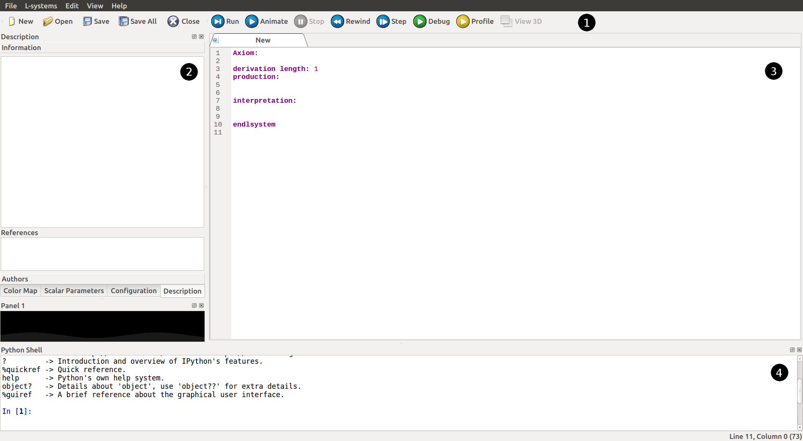
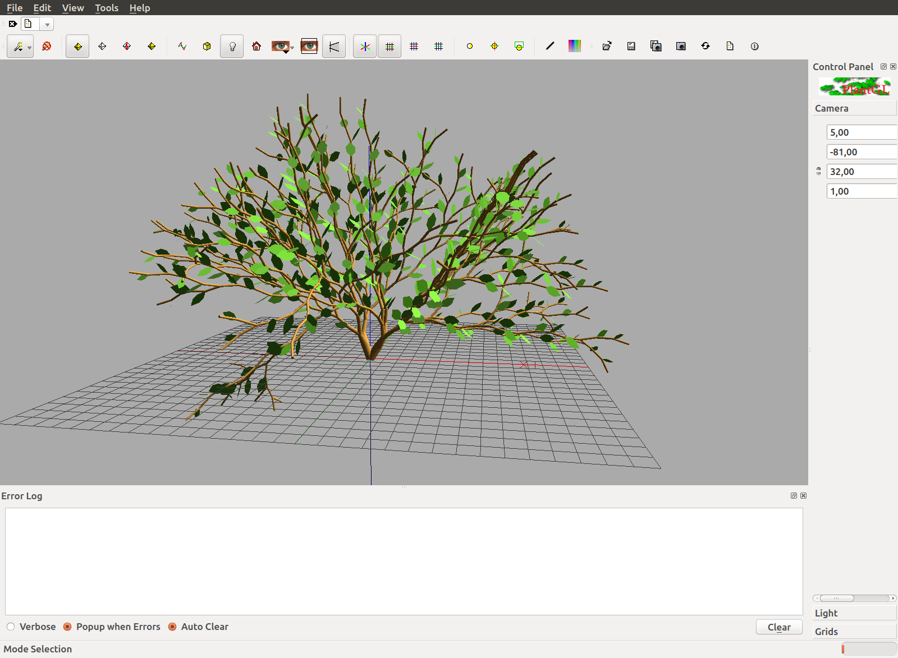
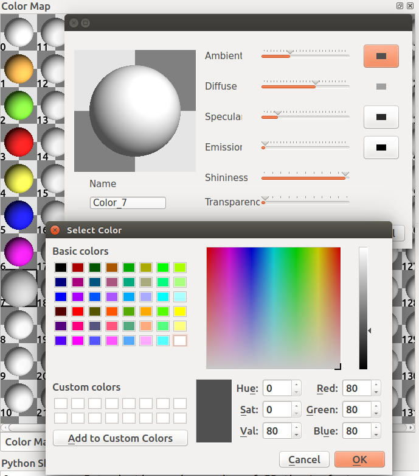
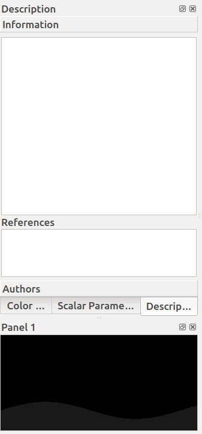
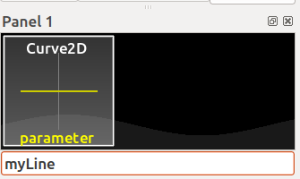
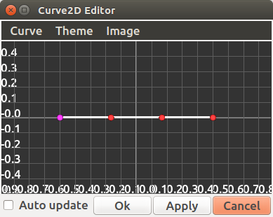
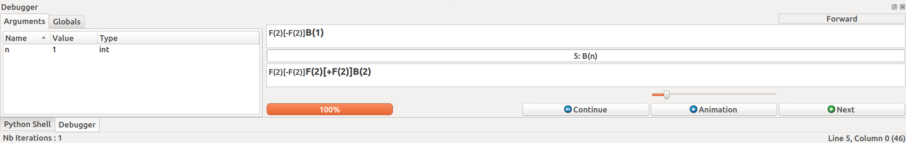
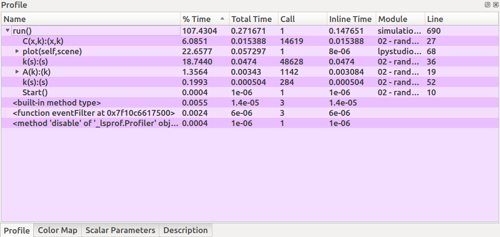

L-Py Editor
###########

.. _Editor_First_Look:

First look on the editor
========================

L-Py has a built-in editor developped with Qt, an UI-designed library.

On start, the editor looks like this:

*1) Top Toolbar*

Here are located the most used features implemented in L-Py. You can create, open or save your current program;
you can run and animate your work with the appropriate buttons or even execute it step by step and ultimately you can debug
or check the process and rendering time with the Profile button.

*2) Sidebar tools*

On the left sidebar, there are of useful tools you can use, you have:

- "Color map" tab where you can create your custom colors and assign these to some objects in your project.
- "Configuration" tab where you can configure your rendering settings.
- "Description" tab where you can write down some notes about your program to describe it or remember important
  facts about your project.

*3) Editor*

L-Py gives you the possibility to code inside the application by a built-in editor. All L-Py keywords are recognized
and colored for a best readability.

*4) Python Shell and custom panels*

By default, the Python Shell is located here but you can add some panels that can be useful in the creation of new
curves (Polyline 2D).

.. _Editor_PlantGL:

PlantGL
=======

When you think your program is ready to be tested, just click on **Run** or **Animate** to visualize your project.

The PlantGL visualizer has a 3D-camera where you can turn around your rendering. The basic controls you'll mostly use are:

- *Hold Left Click* to turn around X and the Y axis of the camera
- *Wheel Mouse* to zoom / unzoom on the scene
- *Hold Right Click* to shift the scene on the screen

.. _Editor_Color_Map:

Color Map
=========

We quickly saw and talked about the custom color palette available in the sidebar tools. It can be used to create
colors and access it directly in your code by avoiding multiple duplications of SetColor(r,g,b[,a])
thanks to the **','** **';'** or **SetColor(index)** instructions.

When double-clicking on a material sphere, a pop-up appears to let you configure your custom material.

Here you can configure the ambient, diffuse, specular and emission color of your material plus its power. Ultimately,
you can also configure the material shininess and transparency to add some properties on your material.

.. _Editor_Custom_Curves:

Custom Curves
=============

Enable the Curve Panel
----------------------

First of all, you need to display the widget **Panel 1**. To do this, right click on an empty space in the top toolbar
and click on **Panel 1** if it's disabled.

The panel is usually located below the Sidebar Tools:

but you can drag this widget anywhere you want in the window for your needs.

Create a Bezier curve
---------------------

To create a custom curve, just right-click in the black panel and select *"New item > Curve2D > BezierCurve"*

A line edit appears at the bottom of the panel to name your curve and confirm it with *Enter*. You can rename your
curve anytime by right-cliking on the curve component and on *"Rename"*.

Configure a curve component
---------------------------

When double left-clicking on your curve component, a new pop-up appears and shows:

In this interface you can:

- *Hold Left Click* on a dot and drag it to change the curvature of the curve
- *Double Left Click* to create a new checkpoint for the curve
- *Double Right Click* on a dot to delete the selected checkpoint
- *Wheel Mouse*  to zoom / unzoom in the interface
- *Hold Left Click* in the black area to shift the curve on the screen

Exemple:

.. image:: ../_images/editor/ex007.png
    :scale: 80%

When you're satisfied with your curve configuration, you can click on the **Apply** button and close the pop-up.

.. _Editor_Debugger:

Debugger
========

As you may know, the render of your project is done with PlantGL. The fact is that L-Py keep as a *string* your project
and, thanks to the string, convert it into instructions to PlantGL.

With the debugger, you can see step by step what is contained in that string and check what's going, to do so, click
on the **Debug** button in the top toolbar.

You'll see a new tab "Debugger" opened at the bottom of L-Py:

At the top, you can see the string representing your project at the beginning of the current step and
below, the string being transformed into by the rules of your project.

The exemple above can be tested with that code:

.. code-block:: python

    Axiom: B(0)
    derivation length: 4

    production:

    B(n):
        if (n % 2):
            produce F(2)[+F(2)]B(n + 1)
        else:
            produce F(2)[-F(2)]B(n + 1)

    endlsystem

and at the step 2 of the debug mode.

.. _Editor_Profiler:

Profiler
========

The profiler is a widget that can help you to see how much time is being spent in each part
of your program. It can be very useful into optimizing your project by fixing some parts of your program.

This is sorted as:

- *Name* : The name of the function
- *% Time* : The task time spent divided by the full time spent multiplied by 100
- *Call* : How much time this function has been called
- *Inline time*
- *Module* : In which module the function has been called
- *Line* : Where does the function start in its module

The *run()* function is basically the entire process, but you can find all your *rules* in this *run()* function
plus the *plot()* function, which is the scene rendering function by PlantGL.
