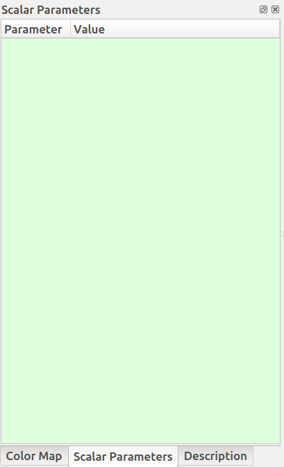
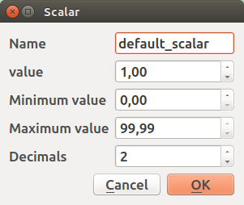
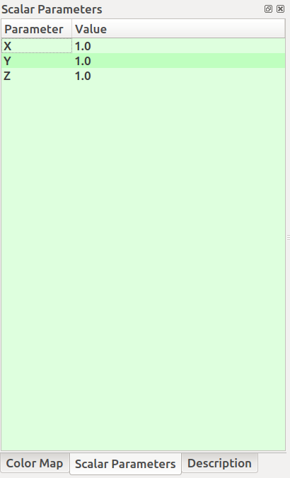
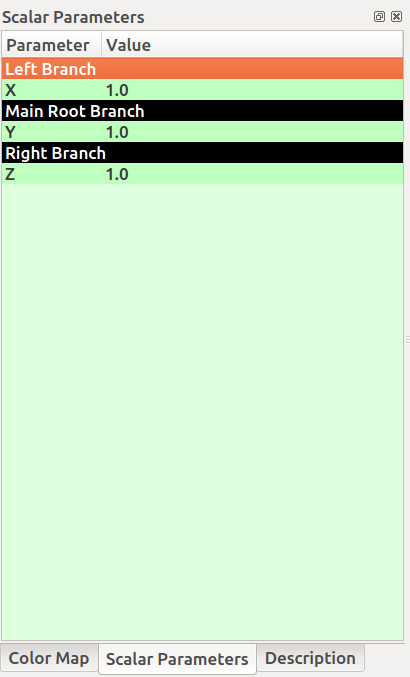
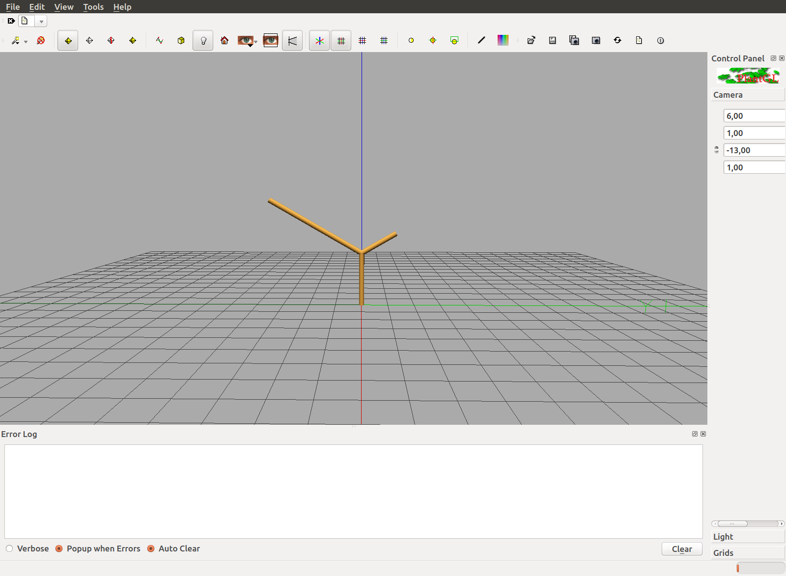

L-Py Editor
###########

.. _Editor_First_Look:

First look on the editor
========================

L-Py has a built-in editor developped with Qt, an UI-designed library.

On start, the editor looks like this:

.. image:: ../_images/editor/ex001.png
    :scale: 60%

*1) Top Toolbar*

Here are located the most used features implemented in L-Py. You can create, open or save your current program;
you can run and animate your work with the appropriate buttons or even execute it step by step and ultimately you can debug
or check the process and rendering time with the Profile button.

*2) Sidebar tools*

On the left sidebar, there are of useful tools you can use, you have:

- "Color map" tab where you can create your custom colors and assign these to some objects in your project.
- "Configuration" tab where you can configure your rendering settings.
- "Description" tab where you can write down some notes about your program to describe it or remember important
  facts about your project.

*3) Editor*

L-Py gives you the possibility to code inside the application by a built-in editor. All L-Py keywords are recognized
and colored for a best readability.

*4) Python Shell and custom panels*

By default, the Python Shell is located here but you can add some panels that can be useful in the creation of new
curves (Polyline 2D).

.. _Editor_PlantGL:

PlantGL
=======

When you think your program is ready to be tested, just click on **Run** or **Animate** to visualize your project.

.. image:: ../_images/editor/ex002.png
    :scale: 60%

The PlantGL visualizer has a 3D-camera where you can turn around your rendering. The basic controls you'll mostly use are:

- *Hold Left Click* to turn around X and the Y axis of the camera
- *Wheel Mouse* to zoom / unzoom on the scene
- *Hold Right Click* to shift the scene on the screen

.. _Editor_Color_Map:

Color Map
=========

We quickly saw and talked about the custom color palette available in the sidebar tools. It can be used to create
colors and access it directly in your code by avoiding multiple duplications of SetColor(r,g,b[,a])
thanks to the **','** **';'** or **SetColor(index)** instructions.

.. image:: ../_images/editor/ex003.png
    :scale: 60%

When double-clicking on a material sphere, a pop-up appears to let you configure your custom material.

Here you can configure the ambient, diffuse, specular and emission color of your material plus its power. Ultimately,
you can also configure the material shininess and transparency to add some properties on your material.

.. _Editor_Scalar_Parameters:

Scalar Parameters
=================

While developing your project, you may encounter the fact when you need to test out some values on an element.
Thanks to the scalar parameters located in the Sidebar Tools, you can create a global variables that will replace some others variables put in
your code.

Let's get into it:

Firstly, create three *float* scalar parameters and name these **X,Y,Z** respectively by right-clicking in the green area.

Here, I'll set all of my variables to have a value in a range between 0 and 10. For this exemple,
the other parameters are not important.

You can see now that the parameters has been added to the widget:

To not get lost by these variables without any sense, you can also add **categories** to sort your variables and
add to it a senseful name.

For my part, I've done this to not get lost in my work:

*Code:*

.. code-block:: python

    Axiom: B[+A][-F(Z)]

    production:

    interpretation:
    A --> F(X)
    B --> F(Y)

    endlsystem

Then, with the code above, double left-click on the values at the right, play with the slider that appeared
and click on **Run** or **Animate**.

The render on PlantGL should display something like this (with X=4, Y=2 and Z=1.5):

See ? The values you put on in the *Scalar Parameters* widget are directly modified into the code and then
displayed on screen as wanted!

And if you're bored to modify the values and to click each time on **Run** or **Animate**, you can also activate the
**Auto-Run** feature, to do so, click on *L-systems > Auto-Run*. It will modify values at runtime when you're changing the values
without the need to re-run or re-animate your project!

.. _Editor_Custom_Curves:

Custom Curves
=============

Enable the Curve Panel
----------------------

First of all, you need to display the widget **Panel 1**. To do this, right click on an empty space in the top toolbar
and click on **Panel 1** if it's disabled.

The panel is usually located below the Sidebar Tools:

.. image:: ../_images/editor/ex004.png
    :scale: 60%

but you can drag this widget anywhere you want in the window for your needs.

Create a Bezier curve
---------------------

To create a custom curve, just right-click in the black panel and select *"New item > Curve2D > BezierCurve"*

.. image:: ../_images/editor/ex005.png
    :scale: 80%

A line edit appears at the bottom of the panel to name your curve and confirm it with *Enter*. You can rename your
curve anytime by right-cliking on the curve component and on *"Rename"*.

Configure a curve component
---------------------------

When double left-clicking on your curve component, a new pop-up appears and shows:

.. image:: ../_images/editor/ex006.png
    :scale: 80%

In this interface you can:

- *Hold Left Click* on a dot and drag it to change the curvature of the curve
- *Double Left Click* to create a new checkpoint for the curve
- *Double Right Click* on a dot to delete the selected checkpoint
- *Wheel Mouse*  to zoom / unzoom in the interface
- *Hold Left Click* in the black area to shift the curve on the screen

Exemple:

.. image:: ../_images/editor/ex007.png
    :scale: 80%

When you're satisfied with your curve configuration, you can click on the **Apply** button and close the pop-up.

.. _Editor_Debugger:

Debugger
========

As you may know, the render of your project is done with PlantGL. The fact is that L-Py keep as a *string* your project
and, thanks to the string, convert it into instructions to PlantGL.

With the debugger, you can see step by step what is contained in that string and check what's going, to do so, click
on the **Debug** button in the top toolbar.

You'll see a new tab "Debugger" opened at the bottom of L-Py:

.. image:: ../_images/editor/ex008.png
    :scale: 60%

At the top, you can see the string representing your project at the beginning of the current step and
below, the string being transformed into by the rules of your project.

The exemple above can be tested with that code:

.. code-block:: python

    Axiom: B(0)
    derivation length: 4

    production:

    B(n):
        if (n % 2):
            produce F(2)[+F(2)]B(n + 1)
        else:
            produce F(2)[-F(2)]B(n + 1)

    endlsystem

and at the step 2 of the debug mode.

.. _Editor_Profiler:

Profiler
========

The profiler is a widget that can help you to see how much time is being spent in each part
of your program. It can be very useful into optimizing your project by fixing some parts of your program.

.. image:: ../_images/editor/ex009.png
    :scale: 60%

This is sorted as:

- *Name* : The name of the function
- *% Time* : The task time spent divided by the full time spent multiplied by 100
- *Call* : How much time this function has been called
- *Inline time*
- *Module* : In which module the function has been called
- *Line* : Where does the function start in its module

The *run()* function is basically the entire process, but you can find all your *rules* in this *run()* function
plus the *plot()* function, which is the scene rendering function by PlantGL.

.. _Editor_Python_Shell:

Python Shell
============

You can find at the bottom of L-Py a Python Shell that can be useful to display at run-time some data from
your project. The Python Shell implemented looks familiar to a simple shell if you're used to a Linux or Mac System:

.. image:: ../_images/editor/ex015.png
    :scale: 60%

You can find in the :ref:`Helpcard_LPy` all of the available commands for the Python Shell. Here will be explained
all known commands at this date:

lstring
-------

When ``lstring`` is called, this command write on the shell the last computed lsystem string of the current simulation.

Do you remember the :ref:`Editor_Scalar_Parameters` exemple ? Try to get it again and try to send the *lstring* command
in the Python Shell, you should have this being returned:

.. code-block:: python

    In [1]: lstring
    Out[1]: AxialTree(B[+A][-F(1.5)])

We can see that, here, the code has been interpreted as an **AxialTree**, which is the system module. This **AxialTree**
contains custom turtle instructions (**B** and **A** here) that will be reinterpreted at the end of the computing as
**F**\ (*Y value*) for **B** and **F**\ (*X value*) for **A**.

.. note::

    Why the X and Y variables has not been replaced by its value is because it is an interpretation of the L-Py program
    of the element and not a production that replaces the variable !

lsystem
-------

When ``lsystem`` is called, this command write on the shell the reference to the internal lsystem object
representing the current simulation.

.. code-block:: python

    In [1]: lsystem
    Out[1]: <openalea.lpy.__lpy_kernel__.Lsystem at 0x7f3b5f0d0890>

window
-------

When ``window`` is called, this command write on the shell the reference to the lpy widget object.

.. code-block:: python

    In [1]: window
    Out[1]: <openalea.lpy.gui.lpystudio.LPyWindow at 0x7f3b866409d0>

The *lsystem* and *window* commands can be useful if you need to know some advanced details on
the current lsystem object represented on-screen.
