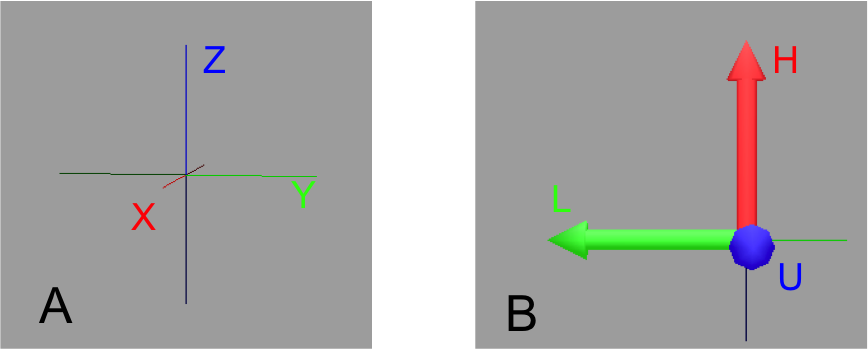
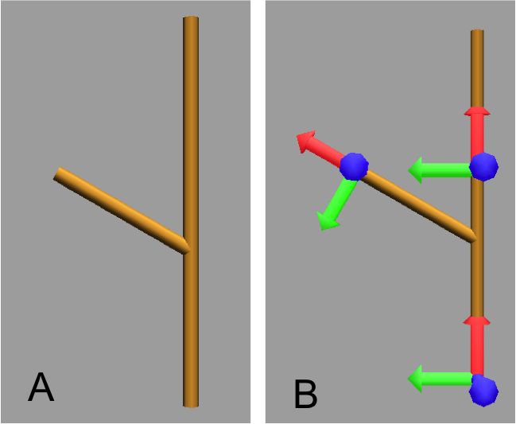
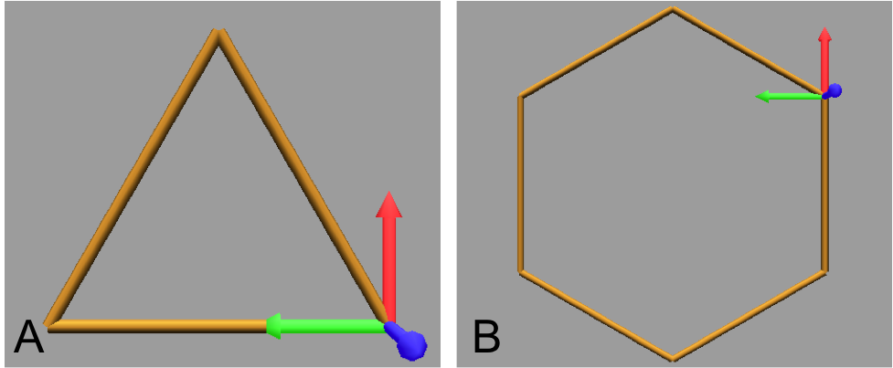
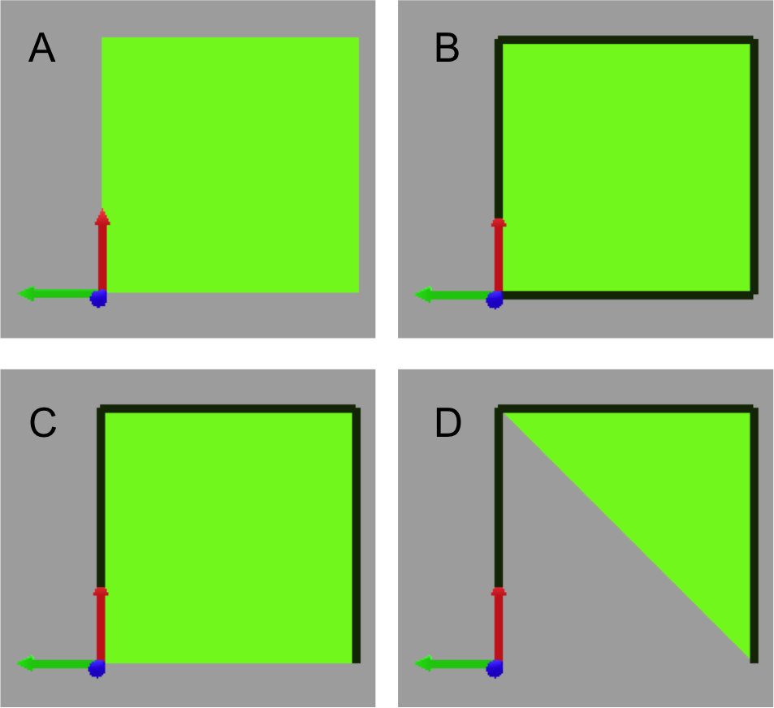
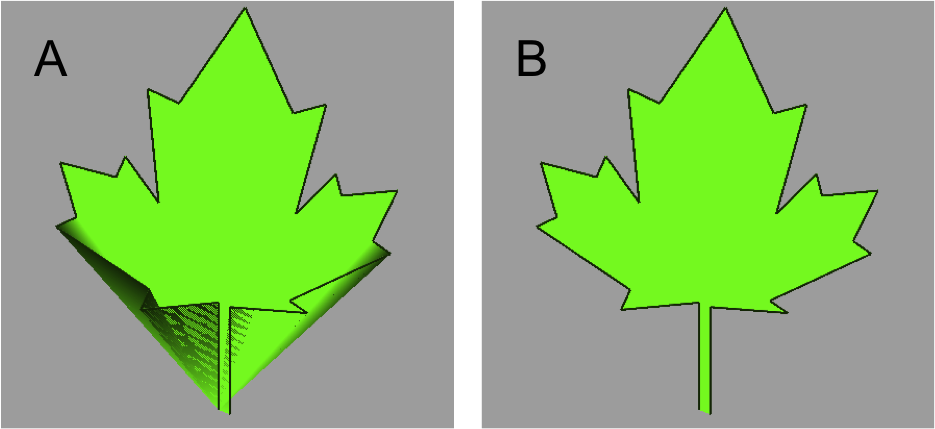
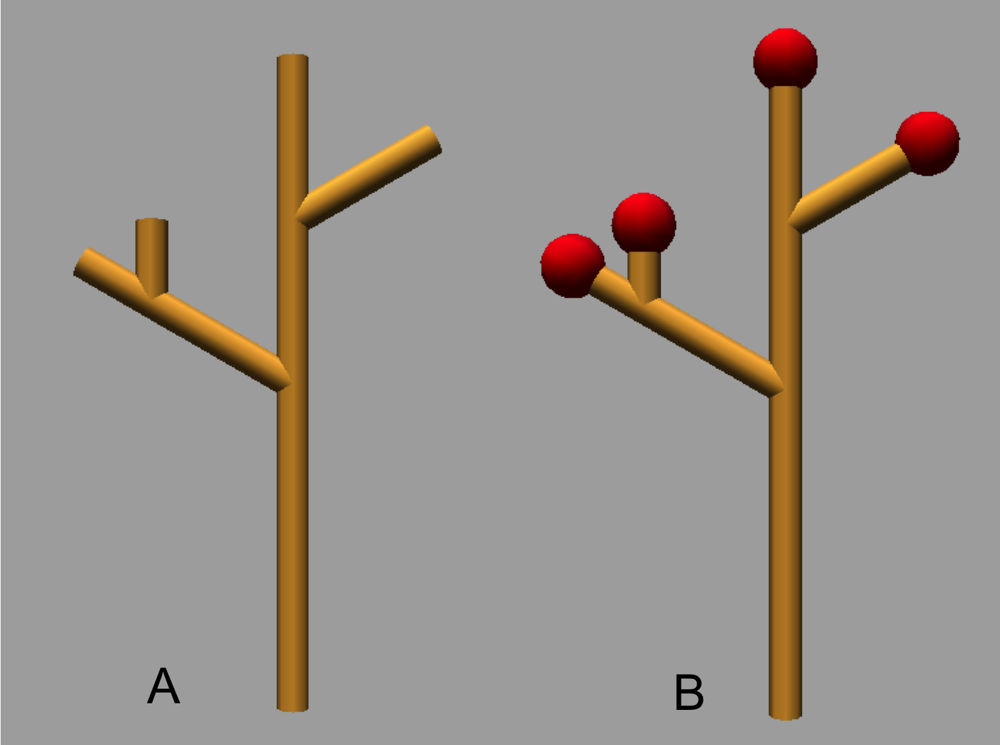
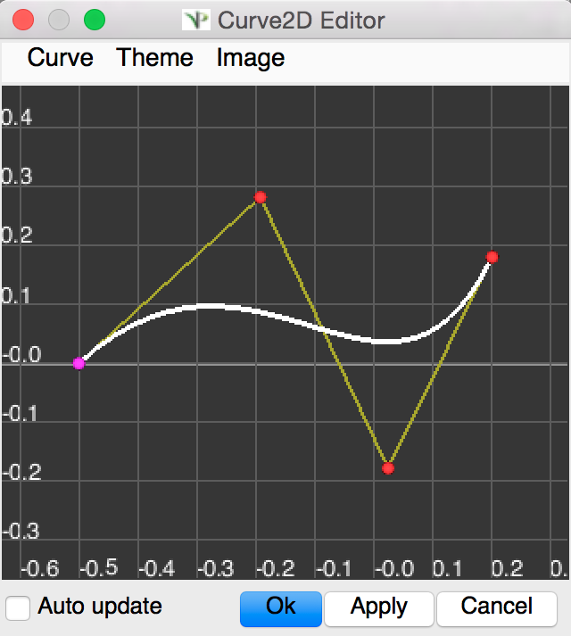
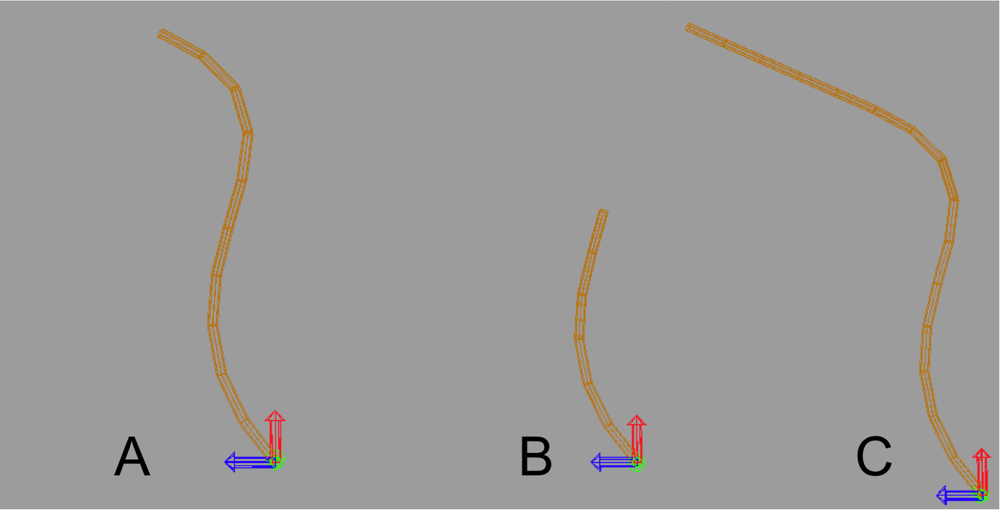

L-Py Turtle explanation
##############

Initial orientation of turtle’s frame
============

Global reference frame (X,Y,Z) of L-Py (A).

The Turtle reference frame (H,L,U) is defined in (B) and can be displayed using primitive **Frame**

.. code-block:: python

    Axiom: Frame

Visualize the turtle reference frame
============

Default angle is 60° ( **+** is identical to **+(60)** )

.. code-block:: python

    Axiom: FF[+ FF]FFF                          # Original code (A)

    Axiom: Frame FF[+ FF Frame ]F Frame FF      # New code with Frames (B)

Rotating with HLU
============

Primitives can be used to rotate the turtle in its current reference frame (H = Head, L = Left, U = Up, angles are expressed by default in degrees).

.. code-block:: python

    Axiom: Frame /(60) Frame     # Around turtle's Head

    Axiom: Frame ^(60) Frame     # Around turtle's Left arm (note that the rotation is indirect)

    Axiom: Frame +(60) Frame     # Around turtle's Up side

.. image:: ../_images/ex003.png

Drawing Polygons
============

Basic method
------------

Turn and move forward

.. code-block:: python

    Axiom: Frame(2)+(30)F(5)+(120)F(5)+(120)F(5)  # (A)

Procedural method
------------

A loop construct can be used to produce the L-string specifying the polygon

.. code-block:: python

    Axiom: Frame(2)+F(5)+F(5)+F(5)+F(5)+F(5)+F(5)  #(B)
    # Or equivalently:
    Axiom:
        nproduce Frame(2)
        for i in range(6):
            nproduce +F(5)

Filled polygon
============

Polygon can be drawn by using {} and positioning a series of dots (‘.’) in space, corresponding to the consecutive vertices of the polygon (A)

Here, the instruction starts by positioning the first vertex of the polygon at the origin of the reference frame

.. code-block:: python

    Axiom:  _(0.05),(2){.f(3).-(90)f(3).-(90)f(3).-(90)f(3)}

The contour of the polygon can be drawn by using **F** instead of **f**. In this case, dots (.) are no longer required after each **F** (B)

.. code-block:: python

    Axiom:  _(0.05),(2){.F(3)-(90)F(3)-(90)F(3)-(90)F(3)}

The number of edges drawn can be different from the number of vertices (C)

.. code-block:: python

    Axiom:  _(0.05),(2){.F(3)-(90)F(3)-(90)F(3)}

Note that if the first dot/point is omitted, the polygon is not closed (D)

.. code-block:: python

    Axiom:  _(0.05),(2){F(3)-(90)F(3)-(90)F(3)}

Filling concave objects requires to use a smarter filling procedure. This can be acheived by using a **True** argument to the polygon drawing (by default the argument is **False**)

.. code-block:: python

    # Naive procedure to fill the concave form: (A)
    Axiom: _(0.01),(2) {.F+(95)F(0.7)-(120)F(0.2)+(80)F-(120)F(0.2)+(80)F(0.5)
    -(120)F(0.5)+(80)F(0.2)-(120)F(0.5)+(150)F-(120)F(0.3)+(80)F -(120)F+(80)F(0.3)
    -(120)F +(150)F(0.5)-(120)F(0.2)+(80)F(0.5)-(120)F(0.5)+(80)F(0.2)-(120)F+(120)F(0.2)
    -(150)F(0.7)+(95)F}(False)
    # while with a smarter procedure: (B)
    Axiom: _(0.01),(2) {.F+(95)F(0.7)-(120)F(0.2)+(80)F-(120)F(0.2)+(80)F(0.5)
    -(120)F(0.5)+(80)F(0.2)-(120)F(0.5)+(150)F-(120)F(0.3)+(80)F -(120)F+(80)F(0.3)
    -(120)F +(150)F(0.5)-(120)F(0.2)+(80)F(0.5)-(120)F(0.5)+(80)F(0.2)-(120)F+(120)F(0.2)
    -(150)F(0.7)+(95)F}(True)

Branching system
============

Bracket makes it possible to specify branches. Before each opening bracket, the turtle parameters (represented by the Frames) are stored on the Turtle stack. These parameters are then pop back when a closing bracket is found.

.. code-block:: python

    Axiom: F(2) [+F[-F(0.5)]F(0.5)] F [-F] F

The same branching system can be augmented with other modules (@**O** for sphere, ...)

.. code-block:: python

    Axiom: F(2) [+F[-F(0.5);(3)@O(0.2)]F(0.5);(3)@O(0.2)] F[-F;(3)@O(0.2)] F;(3)@O(0.2)

SetGuide
============

Drawing a straight line made of length **l=10** with segments of size **dl = 1.0** (and thus contains n= 10 segments) (A)

.. code-block:: python

    Axiom: nF(10, 1.)

By adding the primitive SetGuide before the line drawing, it is possible to specify a curve on which the turtle is moving (instead of heading straight).

The **SetGuide** primitive must be given two mandatory arguments: a curve (Polyline2D or NurbsCurve2D) and a length: **SetGuide(C0, L0)**. This means that, following this statement, the turtle will move on curve **C1** that has been rescaled from **C0** so that its new length is **L0** (whatever its original length).

The guiding curve can be defined in different ways. It can be defined for example by a python function (**function f** defined hereafter), e.g. (B) :

.. code-block:: python

    from openalea.plantgl.all import Polyline2D
    from numpy import arange

    def f(u):
      return (u,u**2)

    C0 = Polyline2D([f(u) for u in arange(0,1,0.1)])     # (B)

or using the embedded L-Py graphical interface for specifying 2D curves (the curve is then given the name **C0** for instance in the interface):

Then using curve **C0** in the **SetGuide** primitive, one can move the turtle over a cumulated length **L**, thus using the defined curve **C1** (rescaled from **C0**) as a guide for moving up to a total length **L0** (C):

.. code-block:: python

    L = 10
    L0 = 10
    Axiom: SetGuide(C0,L0) nF(L, 0.1)

.. image:: ../_images/ex008.png
    :scale: 60%

Note that the turtle can move less than the length of the 2D curve. In this case it will proceed forward over the **L** first units at the beginning of curve **C1** (B). By contrast, if **L** > **L0**, then the turtle keeps on moving straight after reaching length **L0** (C).

.. code-block:: python

    L = 6
    L0 = 10
    Axiom: SetGuide(C0,L0) nF(L, 0.1)     # (B)

    L = 15
    L0 = 10
    Axiom: SetGuide(C0,L0) nF(L, 0.1)     # (C)

