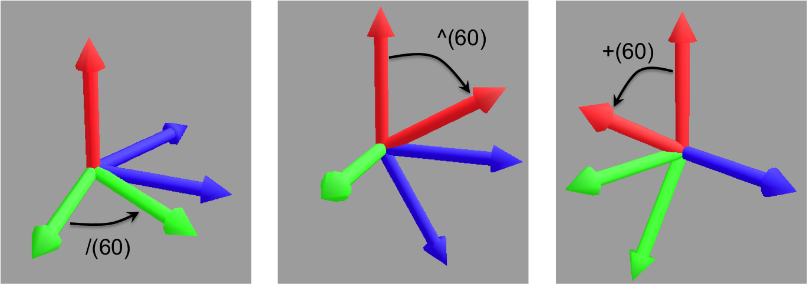

L-Py Turtle explanation
#######################

Turtle basic geometric primitives
~~~~~~~~~~~~~~~~~~~~~~~~~~~~~~~~~

Initial orientation of turtle’s frame
=====================================

Global reference frame (X,Y,Z) of L-Py (A).

The Turtle reference frame (H,L,U) is defined in (B) and can be displayed using primitive **Frame**

- H (Heading) for the turtle's heading. It represents the turtle's sight.

- L (Left) for the turtle's left.

- U (Up) for the turtle's up. it represents the direction that leaves from the turtle's shell

.. code-block:: python

    Axiom: Frame

Download the example : :download:`Frame.lpy <../_downloads/Frame.lpy>`

+--------------------------------+---------------------------------+
| .. image:: ../_images/axis.png | .. image:: ../_images/frame.png |
|    :scale: 100%                |    :scale: 100%                 |
+--------------------------------+---------------------------------+

Visualize the turtle reference frame
====================================

Default angle is 60° ( **+** is identical to **+(60)** )

.. code-block:: python

    Axiom: FF[+ FF]FFF                          # Original code (A)

    Axiom: Frame FF[+ FF Frame ]F Frame FF      # New code with Frames (B)

Download the example : :download:`visualize.lpy <../_downloads/visualize.lpy>`

+-----------------------------------------+--------------------------------------+
| .. image:: ../_images/without_frame.png | .. image:: ../_images/with_frame.png |
|    :scale: 60%                          |    :scale: 60%                       |
+-----------------------------------------+--------------------------------------+

Starting with basic shapes
==========================

First of all, the most basic primitive used to draw is **F**. It moves the turtle forward while drawing a cylinder of one unit.

.. code-block:: python

    Axiom: F

Download the example : :download:`F.lpy <../_downloads/F.lpy>`

+-----------------------------------+
| .. image:: ../_images/F.png 	    |
+-----------------------------------+

**F** can take two arguments (of type float). The first one (default = 1) defines the length of the cylinder drawn and the second one (default = 0.1) defines it's topradius.

.. code-block:: python

    Axiom: F(3)		#(A)

    Axiom: F(3, 2.5) 	#(B)

+------------------------------+--------------------------------+
| .. image:: ../_images/F3.png | .. image:: ../_images/F2,5.png |
|    :scale: 60%               |    :scale: 60%                 |
+------------------------------+--------------------------------+

There are some other primitives which can be used to draw some basic shapes :

.. code-block:: python

	Axiom: @O(1) 	# Draws a sphere at the turtle's position.
	# It can take one argument which is the radius of the sphere. 

	Axiom: @o(1)	# Draws a circle at the turtle's position.
	# It can take one argument which is the radius of the circle. 

	Axiom: @B(1)	# Draws a box at the turtle's position.
	# It can take two argument which are the length of the edges and the topradius. 

	Axiom: @b(1)	# Draws a quad at the turtle's position.
	# It can take two argument which are the length of the edges and the topradius.  

Download the example : :download:`basicShapes.lpy <../_downloads/basicShapes.lpy>`

+----------------------------------+----------------------------------+
| .. image:: ../_images/sphere.png | .. image:: ../_images/circle.png |
+----------------------------------+----------------------------------+
|.. image:: ../_images/box.png     | .. image:: ../_images/quad.png   |
+----------------------------------+----------------------------------+

Text can be displayed using the **@L** primitive but it doesn't appear on screenshots

.. code-block:: python

	Axiom: @L("Some text", 18)	# Draws a text Label at the turtle's position.
	# It can take two arguments which are the text to display and it's size.

Primitive combinations
======================

All these primitives can be combined together. For example :

.. code-block:: python

	Axiom: FF@O(.5)@B(2)Frame

Download the example : :download:`combined.lpy <../_downloads/combined.lpy>`

+------------------------------------+
| .. image:: ../_images/combined.png |
+------------------------------------+

Some useful tools
=================

.. _turtle_color_system:

*Color System*
--------------

To use color system, it is necessary to set materials with the **Color Map** window (:ref:`Editor_Color_Map`).

The semicolon (';') is used to increase the current material index (A) and the comma (',') to decrease it (B).
A argument can be set to specify the index of the material to use.

.. code-block:: python

		Axiom: F(2) ; @O(0.2)  # (A)
		# Or equivalently:
		Axiom: F(2) ;(2) @O(0.2)

		Axiom: F(2) , @O(0.2)  # (B)
		# Or equivalently:
		Axiom: F(2) ,(0) @O(0.2)

+------------------------------------------+------------------------------------------+
| .. image:: ../_images/increase_color.png | .. image:: ../_images/decrease_color.png |
|    :scale: 60%                           |    :scale: 60%                           |
+------------------------------------------+------------------------------------------+

The second manner to set color to an object is to use **SetColor**. There is two way to use it.
The first way is to specify the index of the material (A) and the second way is to set the **rgb** (or rgba) values in arguments (B).

.. code-block:: python

		Axiom: F(2) SetColor(5) @O(0.2)             # (A)

		Axiom: F(2) SetColor(45, 200, 200) @O(0.2)  # (B)

+-------------------------------------+-------------------------------------+
| .. image:: ../_images/setColor1.png | .. image:: ../_images/setColor2.png |
|    :scale: 60%                      |    :scale: 60%                      |
+-------------------------------------+-------------------------------------+

The last manner to use the color system is the method **InterpolateColors**, it mixes up two colors in one.
There are three arguments, the first and the second are the index of materials and the last is optional and it sets a priority to the first or the second color in order to make the final color.

.. code-block:: python

		Step = 20
		DIncr = 1.0 / Step

		Axiom:
		  d = 0.0
		  for i in range(Step):
		    nproduce InterpolateColors(3, 5, d) F(0.1)
		    d += DIncr
		  produce ;(2) @O(0.15)

Download the example : :download:`color.lpy <../_downloads/color.lpy>`

+---------------------------------------------+
| .. image:: ../_images/interpolateColors.png |
+---------------------------------------------+

Drawing more complex shapes with the turtle
~~~~~~~~~~~~~~~~~~~~~~~~~~~~~~~~~~~~~~~~~~~

Moving the turtle
=================

There are some primitives which can be used to change the turtle's position.

*MoveTo and MoveRel*
--------------------

**@M** (or **MoveTo**) moves the turtle's to the given in arguments. Like **Pinpoint** or **@R**, arguments can be three floats or a vector.

.. code-block:: python

	Axiom: @M(0,2,0) Frame 	#(A)

	import numpy as np
	v = np.array([0,1,1])
	Axiom: MoveTo(v)	#(B)

Download the example : :download:`movement.lpy <../_downloads/movement.lpy>`

+---------------------------------------+---------------------------------------+
| .. image:: ../_images/moveTo1.png     | .. image:: ../_images/moveTo2.png     |
|    :scale: 60%                        |    :scale: 60%                        |
+---------------------------------------+---------------------------------------+

**MoveRel** works almost in the same way but it moves the turtle relatively to the current position :

.. code-block:: python

	Axiom: F MoveTo(0,3,0) Frame 	#The turtle moves to the position (0,3,0) (A)

	Axiom: F MoveRel(0,3,0) Frame 	#The turtle moves along the Y axis for 3 units (B)

+----------------------------------------+----------------------------------------+
| .. image:: ../_images/moveRel1.png     | .. image:: ../_images/moveRel2.png     |
|    :scale: 60%                         |    :scale: 60%                         |
+----------------------------------------+----------------------------------------+

*Moving of one or several units*
--------------------------------

The primitive **f** works like **F** except that it doesn't draw anything. The argument defines the number of steps the turtle will move.

.. code-block:: python

	Axiom: F-f+Ff(2)-F(2)

Download the example : :download:`f.lpy <../_downloads/f.lpy>`

+-----------------------------+
| .. image:: ../_images/f.png |
|   :scale: 80%               |
+-----------------------------+

Orient the turtle
=================

The turtle's orientation can be setted using some primitives.

*Pinpoint and PinpointRel*
--------------------------

**Pinpoint** orients the turtle toward x,y and z given in arguments (A). A vector can also be given (B).

.. code-block:: python

	Axiom: Frame Pinpoint(-2,2,-3)	#(A)

	import numpy as np
	v = np.array([1,2,3])
	Axiom: Frame Pinpoint(v)	#(B)

Download the example : :download:`orientation.lpy <../_downloads/orientation.lpy>`

+-------------------------------------+-------------------------------------+
| .. image:: ../_images/pinpoint1.png | .. image:: ../_images/pinpoint2.png |
|    :scale: 100%                     |    :scale: 100%                     |
+-------------------------------------+-------------------------------------+

Such as **MoveRel** for position, **PinpointRel** orients the turtle relatively to the current position.

.. code-block:: python

	Axiom: Frame MoveTo(0,2,0) Pinpoint(1,0,1) Frame 	#(A)

	Axiom: Frame MoveTo(0,2,0) PinpointRel(1,0,1) Frame 	#(B)

+----------------------------------------+----------------------------------------+
| .. image:: ../_images/pinpointRel1.png | .. image:: ../_images/pinpointRel2.png |
|    :scale: 60%                         |    :scale: 60%                         |
+----------------------------------------+----------------------------------------+

*Setting the HLU axis*
----------------------

The H and U axis can be set directly using **@R**. The arguments needed are 6 floats (which represent the coordinates of the two axis) or two vectors.

.. code-block:: python

	Axiom: @R(1,1,1,3,2,1) Frame 	#(A)

	import numpy as np
	h = np.array([1,2,6])
	u = np.array([3,9,7])
	Axiom: @R(h,u) Frame 	#(B)

Download the example : :download:`setHLU.lpy <../_downloads/setHLU.lpy>`

+-------------------------------------+-------------------------------------+
| .. image:: ../_images/@R.png        | .. image:: ../_images/@R2.png       |
|    :scale: 100%                     |    :scale: 100%                     |
+-------------------------------------+-------------------------------------+

Finally, the turtle's orientation can be set using Euler angles with the primitive EulerAngles. Three angles in degrees are needed (default = 180,90,0).

.. code-block:: python

	Axiom: EulerAngles(90,60,0) Frame

+---------------------------------+
| .. image:: ../_images/euler.png |
|   :scale: 120%                  |
+---------------------------------+

*Rotating with HLU (Main primitives)*
-------------------------------------

Primitives can be used to rotate the turtle in its current reference frame (H = Head, L = Left, U = Up, angles are expressed by default in degrees).

.. code-block:: python

    Axiom: Frame /(60) Frame     # Roll left arround the H axis. 

    Axiom: Frame \(60) Frame 	 # Roll right arround the H axis.

    Axiom: Frame ^(60) Frame     # Pitch up arround the L axis. (note that the rotation is indirect)

    Axiom: Frame &(60) Frame 	 # Pitch down arround the L axis. (note that the rotation is indirect)

    Axiom: Frame +(60) Frame     # Turn left arround the U axis.

    Axiom: Frame -(60) Frame 	 # Turn right arround the U axis.

Rescaling the turtle
====================

Three primitives can be used to rescale the turtle : **DivScale**, **MultScale** and **SetScale** (shorter symbols are **@Dd**, **@Di** and **@D** respectively)
**DivScale** (resp. **MultScale**) divides (resp. multiplies) the current scale by the value given in argument. **SetScale** sets the scale to the value in argument.

.. code-block:: python

    Axiom: F@Dd(2)-F 		#(A)

    Axiom: F@Di(3)-F 		#(B)

    Axiom: F@Di(2)-F@D(1)+F 	#(C)

Download the example : :download:`scale.lpy <../_downloads/scale.lpy>`

+------------------------------------+-------------------------------------+------------------------------------+
| .. image:: ../_images/divScale.png | .. image:: ../_images/multScale.png | .. image:: ../_images/setScale.png |
+------------------------------------+-------------------------------------+------------------------------------+

How to draw polygonal shapes ?
==============================

*Basic method*
--------------

Turn and move forward : Here, at each **+**, the turtle does a rotation of the number of degrees indicated in arguments arround the U axis 

.. code-block:: python

    Axiom: Frame(2)+(30)F(5)+(120)F(5)+(120)F(5)  # (A)

Download the example : :download:`polygons.lpy <../_downloads/polygons.lpy>`

*Procedural method*
-------------------

A loop construct can be used to produce the L-string specifying the polygon

.. code-block:: python

    Axiom: Frame(2)+F(5)+F(5)+F(5)+F(5)+F(5)+F(5)  # (B)
    # Or equivalently:
    Axiom:
        nproduce Frame(2)
        for i in range(6):
            nproduce +F(5)

+----------------------------------------+---------------------------------------+
| .. image:: ../_images/basicPolygon.png | .. image:: ../_images/loopPolygon.png |
|    :scale: 50%                         |    :scale: 50%                        |
+----------------------------------------+---------------------------------------+

*Filled polygons*
-----------------

Polygon can be drawn by using {} and positioning a series of dots ('.') in space, corresponding to the consecutive vertices of the polygon (A)

Here, the instruction starts by positioning the first vertex of the polygon at the origin of the reference frame

.. code-block:: python

    Axiom: Frame _(0.05),(2){.f(3).-(90)f(3).-(90)f(3).-(90)f(3)}

The contour of the polygon can be drawn by using **F** instead of **f**. In this case, dots (.) are no longer required after each **F** (B)

.. code-block:: python

    Axiom: Frame _(0.05),(2){.F(3)-(90)F(3)-(90)F(3)-(90)F(3)}

The number of edges drawn can be different from the number of vertices (C)

.. code-block:: python

    Axiom: Frame _(0.05),(2){.F(3)-(90)F(3)-(90)F(3)}

Note that if the first dot/point is omitted, the polygon is not closed (D)

.. code-block:: python

    Axiom: Frame _(0.05),(2){F(3)-(90)F(3)-(90)F(3)}

Download the example : :download:`filledPolygons.lpy <../_downloads/filledPolygons.lpy>`

+------------------------------------------+------------------------------------------+
| .. image:: ../_images/filledPolygon1.png | .. image:: ../_images/filledPolygon2.png |
+------------------------------------------+------------------------------------------+
| .. image:: ../_images/filledPolygon3.png | .. image:: ../_images/filledPolygon4.png |
+------------------------------------------+------------------------------------------+

Filling concave objects requires to use a smarter filling procedure. This can be acheived by using a **True** argument to the polygon drawing (by default the argument is **False**)

.. code-block:: python

    # Naive procedure to fill the concave form: (A)
    Axiom: _(0.01),(2) {.F+(95)F(0.7)-(120)F(0.2)+(80)F-(120)F(0.2)+(80)F(0.5)
    -(120)F(0.5)+(80)F(0.2)-(120)F(0.5)+(150)F-(120)F(0.3)+(80)F -(120)F+(80)F(0.3)
    -(120)F +(150)F(0.5)-(120)F(0.2)+(80)F(0.5)-(120)F(0.5)+(80)F(0.2)-(120)F+(120)F(0.2)
    -(150)F(0.7)+(95)F}(False)
    # while with a smarter procedure: (B)
    Axiom: _(0.01),(2) {.F+(95)F(0.7)-(120)F(0.2)+(80)F-(120)F(0.2)+(80)F(0.5)
    -(120)F(0.5)+(80)F(0.2)-(120)F(0.5)+(150)F-(120)F(0.3)+(80)F -(120)F+(80)F(0.3)
    -(120)F +(150)F(0.5)-(120)F(0.2)+(80)F(0.5)-(120)F(0.5)+(80)F(0.2)-(120)F+(120)F(0.2)
    -(150)F(0.7)+(95)F}(True)

+---------------------------------+---------------------------------+
| .. image:: ../_images/leaf1.png | .. image:: ../_images/leaf2.png |
|    :scale: 50%                  |    :scale: 50%                  |
+---------------------------------+---------------------------------+

Branching system
================

Bracket makes it possible to specify branches. Before each opening bracket, the turtle arguments (position, orientation...) are stored on the Turtle stack. These arguments are then pop back when a closing bracket is found and the drawing will restart there.

.. code-block:: python

	Axiom: F(2) [+FF(0.5)] FF 	#(A)

Then it's possible to imbricate branches inside others :

.. code-block:: python

    Axiom: F(2) [+F[-F(0.5)]F(0.5)] F [-F] F 	#(B)

Download the example : :download:`branching.lpy <../_downloads/branching.lpy>`

+--------------------------------------+--------------------------------------+
| .. image:: ../_images/branching1.png | .. image:: ../_images/branching2.png |
|    :scale: 50%                       |    :scale: 50%                       |
+--------------------------------------+--------------------------------------+

The same branching system can be augmented with other modules (@**O** for sphere, ...)

.. code-block:: python

    Axiom: F(2) [+F[-F(0.5);(3)@O(0.2)]F(0.5);(3)@O(0.2)] F[-F;(3)@O(0.2)] F;(3)@O(0.2)

+--------------------------------------+
| .. image:: ../_images/branching3.png |
|    :scale: 80%                       |
+--------------------------------------+

Advanced primitives
===================

*Long path*
-----------

The primitive **nF** draws n steps of cylinders (n is the first argument). The size can be passed as a second argument.

.. code-block:: python

	Axiom: nF(3,1)+nF(5,1) 	#equivalent to FFF+FFFFF

Download the example : :download:`longPath.lpy <../_downloads/longPath.lpy>`

+--------------------------------+
| .. image:: ../_images/path.png |
|    :scale: 80%                 |
+--------------------------------+

*SetGuide*
----------

Drawing a straight line made of length **l=10** with segments of size **dl = 1.0** (and thus contains n= 10 segments)

.. code-block:: python

    Axiom: nF(10, 1.)	#(A)

By adding the primitive SetGuide before the line drawing, it is possible to specify a curve on which the turtle is moving (instead of heading straight).

The **SetGuide** primitive must be given two mandatory arguments: a curve (Polyline2D or NurbsCurve2D) and a length: **SetGuide(C0, L0)**. This means that, following this statement, the turtle will move on curve **C1** that has been rescaled from **C0** so that its new length is **L0** (whatever its original length).

The guiding curve can be defined in different ways. It can be defined for example by a python function (**function f** defined hereafter), e.g. (B) :

.. code-block:: python

    from openalea.plantgl.all import Polyline2D
    from numpy import arange

    def f(u):
      return (u,u**2)

    C0 = Polyline2D([f(u) for u in arange(0,1,0.1)])  # (B)

Then using curve **C0** in the **SetGuide** primitive, one can move the turtle over a cumulated length **L**, thus using the defined curve **C1** (rescaled from **C0**) as a guide for moving up to a total length **L0**:

.. code-block:: python

    L = 10
    L0 = 10
    Axiom: SetGuide(C0,L0) nF(L, 0.1)

Download the example : :download:`setGuide1.lpy <../_downloads/setGuide1.lpy>` (With a Polyline2D imported from PlantGL)

+-------------------------------------+-------------------------------------+
| .. image:: ../_images/setGuide1.png | .. image:: ../_images/setGuide2.png |
|    :scale: 50%                      |    :scale: 50%                      |
+-------------------------------------+-------------------------------------+

or like the *(C)* example, the embedded L-Py graphical interface can be used to specifying 2D curves (the curve is then given the name **C0** for instance in the interface):

+---------------------------------+-------------------------------------+
| .. image:: ../_images/ex009.png | .. image:: ../_images/setGuide3.png |
|                                 |    :scale: 80%                      |
+---------------------------------+-------------------------------------+

Download the example : :download:`setGuide2.lpy <../_downloads/setGuide2.lpy>` (With a Polyline2D created in the L-Py graphical interface)

Note that the turtle can move less than the length of the 2D curve. In this case it will proceed forward over the **L** first units at the beginning of curve **C1** (D). By contrast, if **L** > **L0**, then the turtle keeps on moving straight after reaching length **L0** (E).

.. code-block:: python

    L = 6
    L0 = 10
    Axiom: SetGuide(C0,L0) nF(L, 0.1)  # (D)

    L = 15
    L0 = 10
    Axiom: SetGuide(C0,L0) nF(L, 0.1)  # (E)

+-------------------------------------+-------------------------------------+
| .. image:: ../_images/setGuide4.png | .. image:: ../_images/setGuide5.png |
|    :scale: 50%                      |    :scale: 50%                      |
+-------------------------------------+-------------------------------------+

To stop using the 2D curve as a guide, **EndGuide** can be used.

*Generalized cylinders*
----------------------

When several rotations are used while drawing, the render at rotation places isn't great. The separation points are really visible. To fix it, **@Gc** (or **StartGC**) can be used.
Until a **@Ge** (or **"EndGC**") all shapes drawn will be merged that so it becomes only one shape.

.. code-block:: python

	Axiom: @GcF+F--F++F+F@Ge-F-F

Download the example : :download:`generalizedCylinders.lpy <../_downloads/generalizedCylinders.lpy>`

+------------------------------------------------+
| .. image:: ../_images/generalizedCylinders.png |
|    :scale: 80%                                 |
+------------------------------------------------+

To go a little bit further
~~~~~~~~~~~~~~~~~~~~~~~~~~

In this section, several less common tools can be found.

SectionResolution
=================

**SectionResolution** allows to change the resolution of all following shapes. **Be careful !** If the resolution is too low, the program may not work properly.

.. code-block:: python

	Axiom: F SectionResolution(4) +F@O(0.5) 	#(A)

	Axiom: F SectionResolution(60) +F@O(0.5) 	#(B)

Download the example : :download:`resolution.lpy <../_downloads/resolution.lpy>`

+---------------------------------------+---------------------------------------+
| .. image:: ../_images/resolution1.png | .. image:: ../_images/resolution2.png |
|    :scale: 50%                        |    :scale: 50%                        |
+---------------------------------------+---------------------------------------+

Screen Projection
=================

After using **@2D** (or **StartScreenProjection**), the following shapes will be drawn on the screen coordinates system (in two dimensions).
The examples below belong to the same axiom, only the camera's orientation is different. It confirms that the shape is in the screen system.

.. code-block:: python

	Axiom: F+F@2DF 

Download the example : :download:`screen.lpy <../_downloads/screen.lpy>`

+-------------------------------+-------------------------------+
| .. image:: ../_images/2D1.png | .. image:: ../_images/2D2.png |
|    :scale: 50%                |    :scale: 50%                |
+-------------------------------+-------------------------------+

To switch back to the original coordinates system, **@3D** (or **EndScreenProjection**) can be used.

Rewriting shapes
~~~~~~~~~~~~~~~~

To clear the viewer, the primitive **None** can be written in the Axiom part.

.. code-block:: python
	
	Axiom: None

*Work in progress*